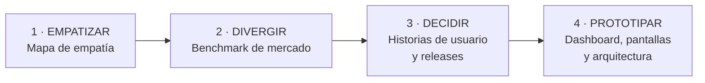
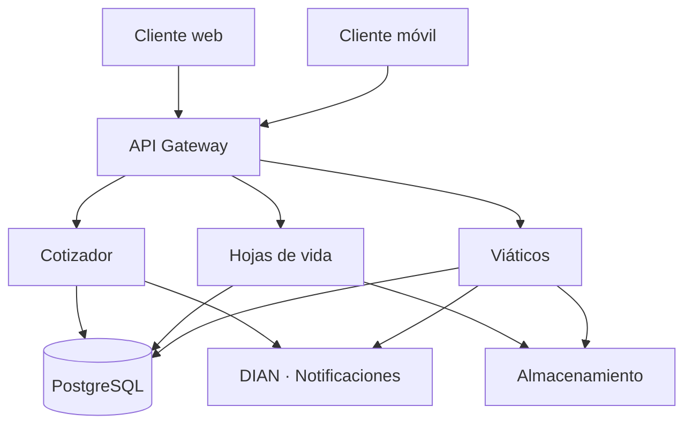

# GALCO · Plataforma interna todo en uno

**Proyecto Integrador 2 · Sprint 0**

*Trabajo bien Hecho!*

---

## Sobre el proyecto

Sistema interno todo en uno para **GALCO S.A.S.** (Itagüí, Antioquia), empresa metalmecánica con más de 26 años en el mercado, especializada en galvanizado en caliente, bandejas portacable, postes metálicos y perfilería estructural.

El sistema reemplaza los procesos manuales actuales (Excel, correo y WhatsApp) con **tres módulos integrados** en una sola plataforma:

| Módulo | Qué resuelve | Usuario |
|---|---|---|
| **Cotizador de productos** | Propuestas comerciales en minutos, con catálogo y precios centralizados | Comercial |
| **Gestor de hojas de vida** | Candidatos y personal centralizados y comparables | RRHH / Admin |
| **Gestor de viáticos** | Registro, soportes y aprobación digital de gastos de viaje | Empleado / Aprobador |

---

## Documentación

La documentación completa está en la **[Wiki del proyecto](https://github.com/jdj40211/GalcoProyecto2/wiki)**.

Copia espejo en [`docs/wiki/`](docs/wiki):

| Página | Contenido |
|---|---|
| [Contexto de la empresa](docs/wiki/01-Contexto-de-la-empresa.md) | Quién es GALCO y cómo opera hoy |
| [Problemática y cifras](docs/wiki/02-Problematica-y-cifras.md) | El dolor cuantificado con fuentes citables |
| [Empatizar](docs/wiki/03-Empatizar.md) | Mapa de empatía del usuario interno |
| [Divergir](docs/wiki/04-Divergir.md) | Benchmark de Odoo, Zoho One y Bitrix24 |
| [Decidir](docs/wiki/05-Decidir.md) | Mapa de historias de usuario y releases |
| [Prototipar](docs/wiki/06-Prototipar.md) | Inventario de pantallas y principios de diseño |
| [Funcionalidades](docs/wiki/07-Funcionalidades.md) | Detalle funcional de los tres módulos |
| [Arquitectura](docs/wiki/08-Arquitectura.md) | Arquitectura por capas y diagramas |
| [Stack tecnológico](docs/wiki/09-Stack-tecnologico.md) | Tecnologías y decisiones de arquitectura |
| [Competencia y ventaja](docs/wiki/10-Competencia-y-ventaja-competitiva.md) | Comparativo de mercado |
| [Manual de marca](docs/wiki/12-Manual-de-marca-y-diseno.md) | Sistema de diseño completo |
| [Prompts de Google Stitch](docs/wiki/13-Prompt-de-Google-Stitch.md) | Prompts para generar todas las pantallas |

---

## Design Thinking

---

## Arquitectura

---

## Stack tecnológico

**Frontend:** React · HTML5 · CSS3 · Android · iOS
**Backend:** Node.js / Python · API REST · Webhooks · Prisma / SQLAlchemy
**Seguridad:** OAuth 2.0 · JWT · control de roles por módulo
**Persistencia:** PostgreSQL · bucket de archivos
**Infraestructura:** Azure o Supabase · HTTPS

---

## Plan de releases

| Release | Tema | Funcionalidades |
|---|---|---|
| **1** | Crear | Crear cotización · Registrar candidato · Registrar solicitud de viático |
| **2** | Gestionar | Catálogo · Enviar al cliente · Buscar candidatos · Actualizar HV · Adjuntar soportes · Aprobar y rechazar |
| **3** | Reportar | Estado de cotización · Reporte de personal · Reporte contable |

---

## Identidad visual

| Color | Hex | Uso |
|---|---|---|
| Azul GALCO | `#0053A1` | Primario |
| Verde GALCO | `#7DB928` | Acento |

Colores extraídos del logo oficial de GALCO mediante análisis de píxeles.
