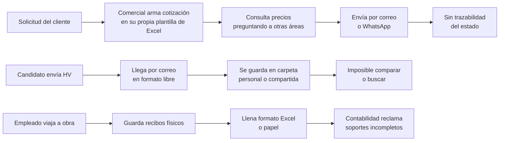

# 01 · Contexto de la empresa

## GALCO S.A.S.

Empresa colombiana de origen paisa, fundada en **1993** y ubicada en **Itagüí, Antioquia** (Calle 35C No. 66B 36, sector Ditaires). Más de **26 años de operación** en el mercado metalmecánico nacional.

**Eslogan:** *Trabajo bien Hecho!*

**Contacto público:** PBX (604) 301 5353 · ventas@galco.com.co · [www.galco.com.co](https://www.galco.com.co)

---

## Líneas de negocio

| Línea | Descripción |
|---|---|
| **Galvanizado en caliente** | Servicio de recubrimiento por inmersión para prevenir corrosión del hierro causada por humedad y contaminación ambiental. Planta de última tecnología. |
| **Conducción eléctrica** | Bandejas portacable tipo escalera, tipo malla (GALCOFIL), canaletas perforadas y canaletas metálicas, cajas. |
| **Perfilería estructural** | Perfiles de acero para estructuras. |
| **Soportería** | Soportes para tubería y redes contra incendio. |
| **Proyectos especiales** | Torres, pórticos, postes y brazos para luminarias, mezanines. |

---

## Sectores atendidos

- **Industrial** — plantas, montajes, mantenimiento
- **Eléctrico** — subestaciones, redes, iluminación pública
- **Construcción e infraestructura** — obra civil, edificaciones, proyectos de gran escala

---

## Cómo opera hoy (situación actual)

GALCO ya cuenta con un sistema interno propio con módulos de Metalmecánica, Galvanizado, Mejoras, Mejora continua, Inventario, Comercial, Almacén, Nómina, Admin y Administración. Sin embargo, **tres procesos críticos quedaron por fuera de la digitalización** y siguen ejecutándose de forma manual:

### Consecuencias directas observadas

| Proceso | Síntoma que reporta el negocio |
|---|---|
| Cotizaciones | El área comercial se queja de que las cotizaciones tardan días en salir. Gerencia pide reducir tiempos de respuesta a clientes industriales. |
| Hojas de vida | Recursos Humanos recibe hojas de vida en formatos distintos y difíciles de comparar. Carpetas dispersas en computadores personales. |
| Viáticos | Contabilidad reclama por soportes de viáticos incompletos o tardíos. Cero visibilidad del estado de aprobación. |

---

## Restricciones del entorno

Estas restricciones condicionan todas las decisiones de diseño del sistema:

1. **Bajo manejo digital del personal de planta y obra.** La interfaz debe ser evidente sin capacitación previa.
2. **Tiempo de capacitación escaso.** El equipo no puede parar la operación para aprender una herramienta compleja.
3. **Trabajo fuera de la planta.** Los viáticos se generan en obra o en visita a cliente fuera de Medellín, sin computador a la mano. Se requiere acceso móvil.
4. **Coexistencia con el sistema actual.** La plataforma debe convivir con los módulos ya existentes de GALCO, no reemplazarlos.

---

**Siguiente:** [[02 Problematica y cifras]]
