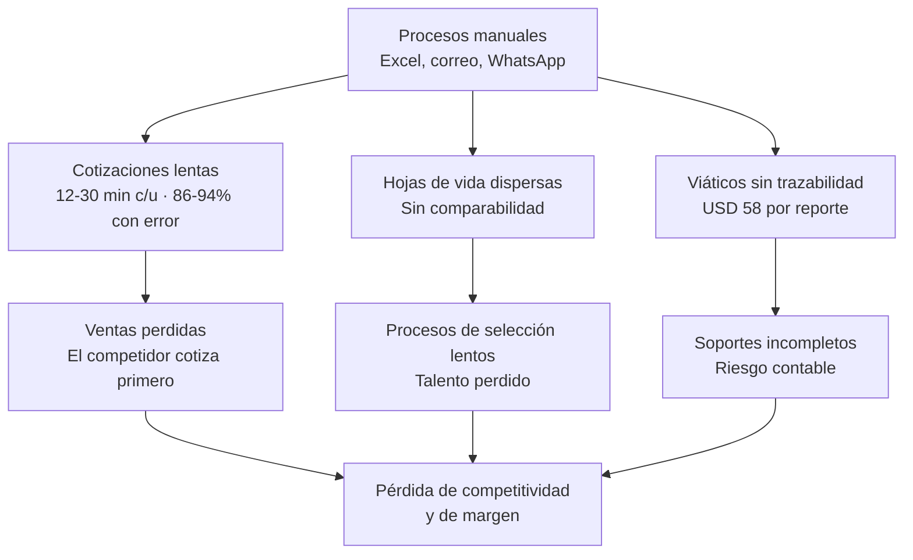

# 02 · Problemática y cifras

> Esta página contiene las cifras exigidas por el formato de sustentación del Sprint 0. Cada dato tiene fuente citable.

---

## El problema en una frase

> GALCO opera tres procesos críticos del negocio (cotizar, contratar y viajar) sobre Excel, correo y WhatsApp. Eso le cuesta ventas, le cuesta talento y le cuesta dinero contable, y ninguno de los tres costos es visible hoy.

---

## Cifra 1 · El contexto nacional

| Dato | Valor | Fuente |
|---|---|---|
| Participación de las pymes en el tejido empresarial colombiano | **99,5 %** | Cámara Colombiana de Comercio Electrónico |
| Empleo generado por pymes en Colombia | **65 %** | Cámara Colombiana de Comercio Electrónico |
| Mipymes formales en nivel **avanzado** de transformación digital | **solo 30 %** | Centro Nacional de Consultoría |
| Ahorro de tiempo administrativo al automatizar procesos | **hasta 50 %** | Estudios de automatización para pymes, 2025 |

**Lectura para la sustentación:** siete de cada diez empresas del país están donde está GALCO en estos tres procesos. No es un caso aislado, es el estándar nacional, y ahí está la oportunidad.

---

## Cifra 2 · El costo de cotizar a mano

| Dato | Valor | Fuente |
|---|---|---|
| Tiempo de una cotización B2B manual | **12 a 30 minutos** | Análisis de automatización comercial B2B (Cheetrack) |
| Buscar precios pactados por cliente | 3 a 8 min | ídem |
| Verificar stock producto a producto | 2 a 5 min | ídem |
| Armar el documento en Excel o Word | 3 a 10 min | ídem |
| Tiempo del equipo comercial gastado en tareas administrativas | **27 %** de su jornada | ídem |
| Capacidad diaria de un vendedor cotizando a mano | **10 a 20** cotizaciones | ídem |
| Capacidad diaria del mismo vendedor con cotizador automatizado | **40 a 60** cotizaciones | ídem |

**Lectura:** el mismo vendedor, con la misma jornada, **triplica su capacidad**. En ventas B2B industriales el que cotiza primero suele ganar el negocio, porque el cliente compra en el momento en que está planificando. Si la cotización llega dos días después, ese momento ya pasó.

---

## Cifra 3 · El costo del error en Excel

| Dato | Valor | Fuente |
|---|---|---|
| Hojas de cálculo operativas que contienen al menos un error | **86 % a 94 %** | Ray Panko, Universidad de Hawái, revisión de 13 estudios (1995-2004) |
| Tasa de error por celda | **5,2 %** promedio | ídem |

**Lectura:** cuando una cotización de bandeja portacable o de estructura metálica se calcula a mano en Excel, la probabilidad de que tenga un error no es marginal, es la norma estadística. Un error de precio en una cotización industrial se paga con margen perdido o con un cliente molesto.

---

## Cifra 4 · El costo de los viáticos manuales

| Dato | Valor | Fuente |
|---|---|---|
| Costo administrativo de procesar **un** reporte de gastos manual | **USD 58** | GBTA Foundation, *Expense Reporting: Global Practices and Pain Points* |
| Tiempo de procesamiento por reporte | **20 minutos** | ídem |
| Reportes de gastos que llegan con errores | **1 de cada 5 (20 %)** | ídem |
| Costo adicional de corregir un reporte con error | **USD 52** y **18 minutos** extra | ídem |

**Lectura:** cada solicitud de viático que un empleado de GALCO llena en un formato de Excel y manda por correo le cuesta a la empresa cerca de **USD 58** en tiempo administrativo antes de contar el viático mismo. Uno de cada cinco vuelve por error y suma otros **USD 52**. Ese costo hoy no aparece en ningún estado financiero, pero se paga.

---

## Cifra 5 · El costo de reclutar sin sistema

Recursos Humanos recibe hojas de vida **en formatos distintos**, guardadas en **carpetas personales o compartidas desordenadas**. Esto produce tres costos medibles:

1. **Imposibilidad de comparar** candidatos bajo los mismos criterios, lo que alarga cada proceso de selección.
2. **Pérdida de información**: la hoja de vida existe pero nadie sabe en qué computador quedó.
3. **Re-trabajo**: se vuelve a publicar una vacante para un perfil que ya se había recibido meses atrás.

---

## Síntesis del dolor

---

## Fuentes

- [GBTA — How Much Do Expense Reports Really Cost a Company?](https://gbta.org/how-much-do-expense-reports-really-cost-a-company/)
- [Ray Panko — A critical review of the literature on spreadsheet errors](http://mba.tuck.dartmouth.edu/spreadsheet/product_pubs_files/literature.pdf)
- [Cheetrack — Cómo reducir el tiempo de cotización B2B](https://www.cheetrack.com/blog/reducir-tiempo-cotizacion)
- [Cámara Colombiana de Comercio Electrónico — Hacia la transformación digital de las MiPymes en Colombia](https://ccce.org.co/noticias/hacia-la-transformacion-digital-de-las-mipymes-en-colombia/)
- [Portal ERP — 2025: el año en que las pymes colombianas deberán reinventarse](https://portalerp.com.co/2025-el-ano-en-que-las-pymes-colombianas-deberan-reinventarse-o-desaparecer)

---

**Anterior:** [[01 Contexto de la empresa]] · **Siguiente:** [[03 Empatizar]]
