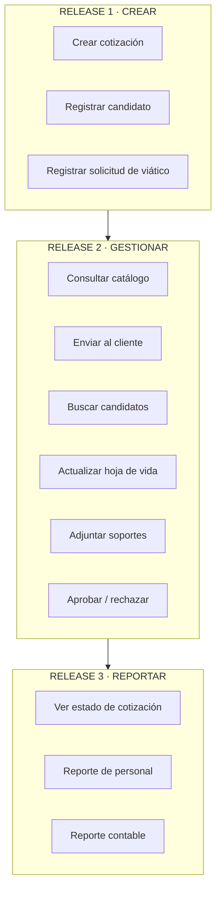

# 05 · Decidir — Mapa de historias de usuario y releases

**Momento 3 del Design Thinking.** Con el dolor entendido y el mercado revisado, decidimos qué se construye y en qué orden.

---

## Criterio de priorización

Las funcionalidades se organizaron en tres releases siguiendo una progresión natural de madurez:

```
Release 1 → CREAR      El sistema empieza a recibir información
Release 2 → GESTIONAR  La información se consulta, se mueve y se aprueba
Release 3 → REPORTAR   La información se convierte en decisiones
```

Este orden garantiza que al final del Release 1 ya haya **algo usable en producción**, no una mitad de sistema.

---

## Mapa de historias de usuario

### Módulo 1 · Cotizador de productos

| | |
|---|---|
| **Usuario** | Comercial |
| **Actividad** | Gestión de cotizaciones |

| Tarea | Release |
|---|---|
| Crear cotización | **Release 1** |
| Consultar catálogo | **Release 2** |
| Enviar al cliente | **Release 2** |
| Ver estado | **Release 3** |

---

### Módulo 2 · Gestor de hojas de vida

| | |
|---|---|
| **Usuario** | RRHH / Admin |
| **Actividad** | Gestión de hojas de vida |

| Tarea | Release |
|---|---|
| Registrar candidato | **Release 1** |
| Buscar candidatos | **Release 2** |
| Actualizar hoja de vida | **Release 2** |
| Reporte de personal | **Release 3** |

---

### Módulo 3 · Gestor de viáticos

| | |
|---|---|
| **Usuarios** | Empleado · Aprobador |
| **Actividad** | Gestión de viáticos |

| Tarea | Release |
|---|---|
| Registrar solicitud | **Release 1** |
| Adjuntar soportes | **Release 2** |
| Aprobar / rechazar | **Release 2** |
| Reporte contable | **Release 3** |

---

## Vista consolidada de releases



---

## Qué entrega cada release al negocio

| Release | Valor entregado | Dolor que apaga |
|---|---|---|
| **Release 1** | La información deja de nacer en Excel y en WhatsApp. Todo entra al sistema desde el primer día. | Pérdida de información y de control |
| **Release 2** | El trabajo fluye solo: precios actualizados, envío directo, aprobación digital con soportes. | Lentitud y dependencia de terceros |
| **Release 3** | Gerencia, RRHH y Contabilidad ven el estado real sin pedirle nada a nadie. | Falta de visibilidad y trazabilidad |

---

## Roles y permisos definidos

| Rol | Cotizador | Hojas de vida | Viáticos |
|---|---|---|---|
| **Comercial** | Crear, consultar, enviar, ver estado | Sin acceso | Crear solicitud propia |
| **RRHH / Admin** | Sin acceso | Acceso completo + reportes | Crear solicitud propia |
| **Empleado** | Sin acceso | Ver y actualizar su propia HV | Crear solicitud, adjuntar soportes |
| **Aprobador** | Ver estados | Sin acceso | Aprobar, rechazar, ver soportes |
| **Contabilidad** | Ver cotizaciones aprobadas | Sin acceso | Reporte contable, liquidación |

---

**Anterior:** [[04 Divergir]] · **Siguiente:** [[06 Prototipar]]
