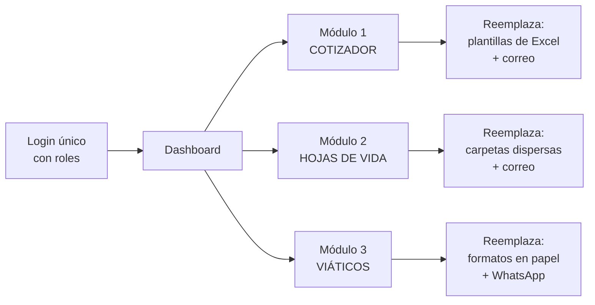

# 07 · Funcionalidades del sistema

> Página principal para la sustentación del bloque de funcionalidades.

---

## Visión general

Una sola plataforma, un solo login, tres módulos. Cada módulo apaga uno de los tres procesos manuales identificados en el [[03 Empatizar|mapa de empatía]].

---

# Módulo 1 · Cotizador de productos

**Usuario:** Comercial · **Actividad:** Gestión de cotizaciones

## Qué hace

Convierte la elaboración de una cotización de un ejercicio manual de Excel a un flujo guiado de tres pasos con catálogo y precios centralizados.

## Funcionalidades

### F1.1 — Crear cotización `Release 1`

Flujo de tres pasos:

1. **Seleccionar cliente** — se elige de la base de clientes ya registrados o se crea uno nuevo. El sistema trae automáticamente NIT, contacto, dirección y condiciones comerciales pactadas.
2. **Agregar productos del catálogo** — búsqueda por nombre o referencia. Al seleccionar bandeja portacable, poste, canaleta o servicio de galvanizado, el sistema trae **precio vigente, unidad de medida y especificación técnica**. Se indica cantidad.
3. **Revisar y confirmar** — el sistema calcula subtotal, descuentos aplicables, IVA y total. Genera número consecutivo de cotización y fecha de vigencia.

**Qué elimina:** los 3 a 8 minutos de buscar precios preguntando a otras áreas, los 2 a 5 minutos de verificar disponibilidad y los 3 a 10 minutos de armar el documento a mano. Y elimina el riesgo estadístico de error de fórmula de Excel, que según Panko afecta entre el 86 % y el 94 % de las hojas operativas.

### F1.2 — Consultar catálogo `Release 2`

Catálogo centralizado y único de todos los productos y servicios de GALCO:

- Bandejas portacable (tipo escalera, tipo malla GALCOFIL, canaletas perforadas, canaletas metálicas)
- Perfilería estructural
- Soportes para tubería y redes contra incendio
- Postes y brazos para luminarias
- Servicio de galvanizado en caliente

Cada producto incluye: **referencia, descripción técnica, dimensiones, unidad de medida, precio vigente y fecha de última actualización**.

**Punto clave para la sustentación:** el precio se actualiza en **un solo lugar**. Hoy, cuando cambia el precio del acero, hay que avisarle a cada comercial y esperar que actualice su propia plantilla. Con el catálogo centralizado, se cambia una vez y todos cotizan bien desde ese segundo.

### F1.3 — Enviar al cliente `Release 2`

Genera un **PDF con la identidad de marca GALCO** y lo envía por correo desde el sistema, sin salir a Outlook ni a WhatsApp. Queda registro de a quién se envió, cuándo y con qué contenido exacto.

### F1.4 — Ver estado `Release 3`

Cada cotización tiene un estado visible: **Borrador → Enviada → En negociación → Aprobada / Rechazada / Vencida**.

Permite al comercial y a gerencia saber en cualquier momento cuántas cotizaciones hay abiertas, por cuánto valor y cuáles están por vencer.

---

# Módulo 2 · Gestor de hojas de vida

**Usuario:** RRHH / Admin · **Actividad:** Gestión de hojas de vida

## Qué hace

Centraliza en una sola base todos los candidatos y el personal activo, con la misma estructura de información para todos, lo que los hace comparables por primera vez.

## Funcionalidades

### F2.1 — Registrar candidato `Release 1`

Formulario estructurado con campos obligatorios: **datos personales, formación académica, experiencia laboral, cargo al que aspira, certificaciones y adjunto de la hoja de vida en PDF**.

**Qué elimina:** el problema declarado por RRHH de recibir hojas de vida "en formatos distintos y difíciles de comparar". Al capturar la información en campos y no en un archivo libre, dos candidatos siempre se pueden comparar bajo el mismo criterio.

### F2.2 — Buscar candidatos `Release 2`

Búsqueda con filtros combinables: **cargo, años de experiencia, formación, certificaciones, ciudad, estado del proceso**.

**Qué elimina:** el re-trabajo de volver a publicar una vacante para un perfil que ya se había recibido meses atrás. La base de candidatos se vuelve un activo reutilizable en lugar de una carpeta muerta.

### F2.3 — Actualizar hoja de vida `Release 2`

El empleado activo puede mantener su propia hoja de vida al día (nuevas certificaciones, cursos, cambios de datos). RRHH valida y aprueba los cambios.

**Qué elimina:** las carpetas guardadas en computadores personales que quedan desactualizadas y que nadie sabe dónde están.

### F2.4 — Reporte de personal `Release 3`

Reportes para Gerencia y RRHH: **planta actual por área y cargo, procesos de selección abiertos, tiempo promedio de contratación, vencimiento de certificaciones**.

---

# Módulo 3 · Gestor de viáticos

**Usuarios:** Empleado (solicita) · Aprobador (autoriza) · **Actividad:** Gestión de viáticos

## Qué hace

Digitaliza el ciclo completo del gasto de viaje: solicitud, soporte, aprobación y liquidación, con trazabilidad total.

## Funcionalidades

### F3.1 — Registrar solicitud `Release 1`

Formulario móvil corto: **destino, cliente u obra, motivo del viaje, fechas, medio de transporte y monto estimado por concepto** (transporte, alojamiento, alimentación, otros).

**Diseñado para móvil desde el día uno**, porque el viaje a obra o a cliente fuera de Medellín ocurre lejos de un computador.

### F3.2 — Adjuntar soportes `Release 2`

El empleado toma **foto del recibo con la cámara del celular** y queda adjunto a la solicitud al instante. El sistema no permite pasar a liquidación si falta algún soporte.

**Qué elimina:** el reclamo de Contabilidad por "soportes de viáticos incompletos o tardíos". Según GBTA, **1 de cada 5 reportes de gastos manuales llega con error**, y corregir cada uno cuesta 18 minutos y USD 52 adicionales.

### F3.3 — Aprobar o rechazar `Release 2`

El aprobador recibe **notificación por correo o WhatsApp**, ve la solicitud con sus soportes y aprueba o rechaza con un comentario. Todo queda con fecha, hora y responsable.

**Estados visibles:** Borrador → Enviada → Aprobada / Rechazada → Liquidada.

**Qué elimina:** el costo de USD 58 y 20 minutos por reporte de gastos procesado manualmente, según la GBTA Foundation.

### F3.4 — Reporte contable `Release 3`

Consolidado para Contabilidad: **viáticos por período, por centro de costo, por proyecto u obra, por empleado**. Exportable e integrable con la nómina y con facturación electrónica DIAN.

---

# Funcionalidades transversales

| Funcionalidad | Descripción |
|---|---|
| **Login único con control de roles** | Un solo usuario y contraseña. Cada persona ve únicamente los módulos de su rol (comercial, RRHH, contabilidad, aprobador). |
| **Dashboard con indicadores** | Pantalla de entrada con KPI del mes y tabla de actividad reciente. |
| **Notificaciones** | Correo y WhatsApp para eventos que requieren acción: cotización por vencer, viático pendiente de aprobación, candidato nuevo. |
| **Acceso móvil real** | Web responsive y app móvil para registrar viáticos y consultar cotizaciones en campo. |
| **Trazabilidad completa** | Toda acción queda registrada con usuario, fecha y hora. |
| **Integración DIAN** | Facturación electrónica desde la cotización aprobada. |

---

## Tabla resumen de funcionalidades

| # | Funcionalidad | Módulo | Usuario | Release |
|---|---|---|---|---|
| F1.1 | Crear cotización | Cotizador | Comercial | 1 |
| F1.2 | Consultar catálogo | Cotizador | Comercial | 2 |
| F1.3 | Enviar al cliente | Cotizador | Comercial | 2 |
| F1.4 | Ver estado | Cotizador | Comercial | 3 |
| F2.1 | Registrar candidato | Hojas de vida | RRHH / Admin | 1 |
| F2.2 | Buscar candidatos | Hojas de vida | RRHH / Admin | 2 |
| F2.3 | Actualizar hoja de vida | Hojas de vida | RRHH / Empleado | 2 |
| F2.4 | Reporte de personal | Hojas de vida | RRHH / Gerencia | 3 |
| F3.1 | Registrar solicitud | Viáticos | Empleado | 1 |
| F3.2 | Adjuntar soportes | Viáticos | Empleado | 2 |
| F3.3 | Aprobar / rechazar | Viáticos | Aprobador | 2 |
| F3.4 | Reporte contable | Viáticos | Contabilidad | 3 |

---

**Anterior:** [[06 Prototipar]] · **Siguiente:** [[08 Arquitectura]]
