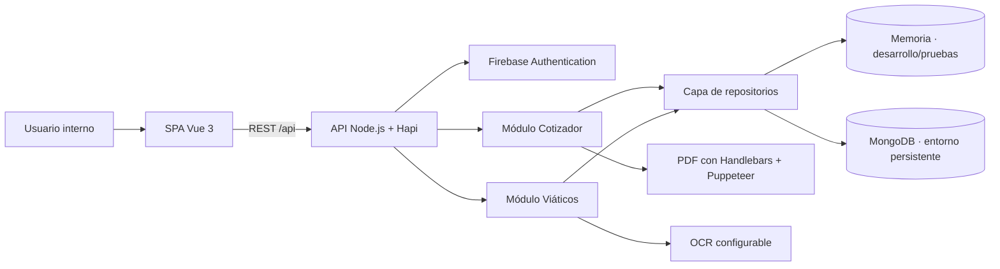
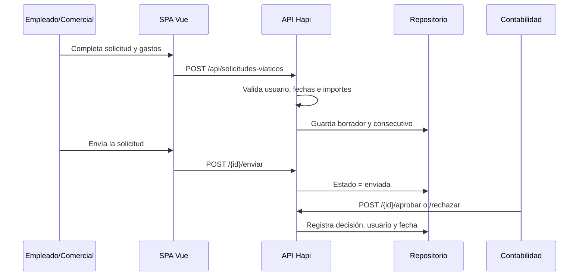

# 08 · Arquitectura implementada

> Esta página describe el código ejecutable del MVP. Sustituye la arquitectura aspiracional de Sprint 0 para evitar diferencias entre documentación, demostración y repositorio.

## Vista general

## Decisión para el MVP

Se implementó un **monolito modular**: una sola aplicación web y una sola API, separadas internamente por dominio. Para un equipo académico y un primer MVP ofrece despliegue, depuración y pruebas simples, sin perder límites claros entre Cotizador y Viáticos. La extracción a servicios independientes queda disponible si el volumen o la operación lo justifican con evidencia.

## Capas y responsabilidades

| Capa         | Implementación                | Responsabilidad                                                           |
| ------------ | ----------------------------- | ------------------------------------------------------------------------- |
| Presentación | Vue 3, Vue Router, Pinia, CSS | Navegación, formularios, validación inmediata y estados visuales          |
| API          | Hapi                          | Rutas REST, validación de entrada, autenticación y autorización           |
| Dominio      | Servicios por módulo          | Cálculos de postes, consecutivos, solicitudes, OCR y aprobaciones         |
| Datos        | Repositorios intercambiables  | Persistencia en memoria para pruebas o MongoDB para ejecución persistente |
| Salidas      | Puppeteer, TXT                | Cotización PDF y exportación contable                                     |

## Módulos entregados

### Cotizador de postes

- Consulta parámetros y catálogos de configuraciones.
- Calcula materiales, áreas, pesos, costos, AIU y precio final.
- Guarda una instantánea de configuración y parámetros para reproducibilidad.
- Genera consecutivo anual y cotización PDF con vigencia.
- Permite consultar el historial.

### Gestión de viáticos

- Crea solicitudes de viaje con gastos estimados y total automático.
- Maneja estados borrador, enviada, aprobada y rechazada según el rol.
- Recibe soportes JPG, PNG o PDF de máximo 10 MB.
- Extrae y permite corregir datos OCR conservando trazabilidad.
- Ofrece historial, revisión contable, indicadores y exportación TXT.

## Seguridad

- Firebase verifica identidad cuando se configura un proyecto real.
- El modo demostración está aislado por configuración y no debe habilitarse en producción.
- La API aplica autorización por rol y limita los registros al usuario propietario.
- Joi valida cada entrada antes de ejecutar lógica de negocio.
- Los secretos se cargan por variables de entorno y los archivos `.env` están excluidos de Git.
- Dependabot, auditoría de dependencias y CodeQL cubren vulnerabilidades conocidas y análisis de código.

## Persistencia y deuda conocida

MongoDB es la opción persistente implementada. El repositorio en memoria permite demostración y pruebas reproducibles. Antes de producción se debe configurar MongoDB, usar Firebase real y mover los soportes desde documentos codificados a un almacenamiento privado de objetos con URLs firmadas.

## Flujo de una solicitud de viaje

**Anterior:** [[07 Funcionalidades]] · **Siguiente:** [[09 Stack tecnologico]]
