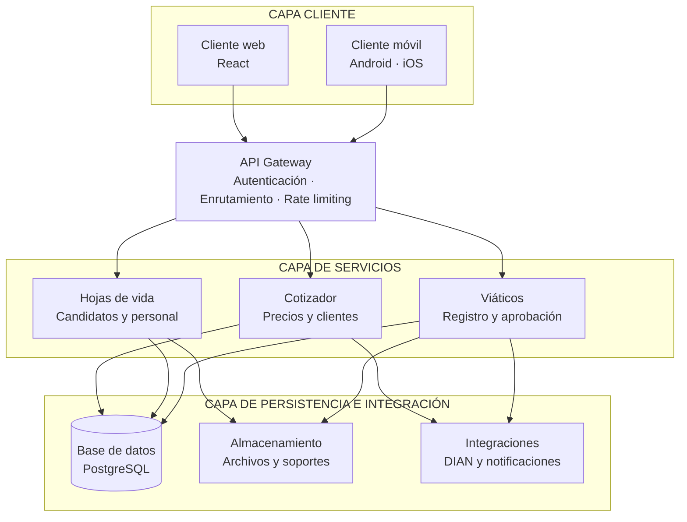
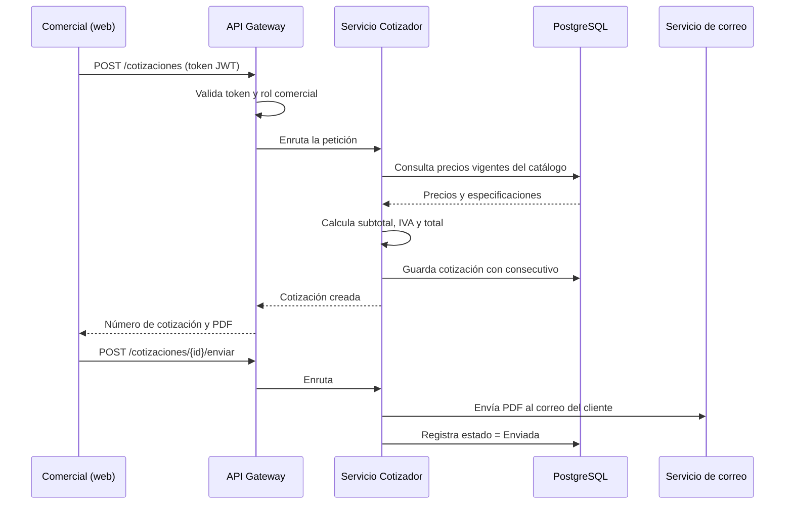

# 08 · Arquitectura de la solución

---

## Diagrama de componentes

---

## Arquitectura por capas

### Capa Cliente

| Componente | Rol |
|---|---|
| **Cliente web (React)** | Interfaz principal para comercial, RRHH, contabilidad y aprobadores desde el computador. |
| **Cliente móvil (Android / iOS)** | Registro de viáticos en obra y consulta de cotizaciones en campo. Acceso a cámara para soportes. |

### API Gateway

Punto único de entrada. Responsabilidades:

- **Autenticación y autorización** — valida el token JWT y el rol antes de enrutar.
- **Enrutamiento** — dirige la petición al microservicio correspondiente.
- **Control de tráfico** — límites de tasa y protección básica.
- **Punto único de auditoría** — toda petición queda registrada aquí.

**Por qué un gateway:** el cliente móvil y el web hablan con una sola URL. Si mañana se agrega un cuarto módulo, el cliente no cambia.

### Capa de servicios (microservicios)

| Servicio | Responsabilidad | Datos que posee |
|---|---|---|
| **Cotizador** | Catálogo, precios, clientes, cotizaciones y sus estados | Productos, precios vigentes, clientes, cotizaciones |
| **Hojas de vida** | Candidatos, personal, procesos de selección | Candidatos, empleados, formación, experiencia |
| **Viáticos** | Solicitudes, soportes, flujo de aprobación, liquidación | Solicitudes, adjuntos, aprobaciones, centros de costo |

**Por qué microservicios y no un monolito:** cada módulo corresponde a un release independiente y a un área distinta de la empresa. Si el módulo de viáticos falla un lunes de cierre contable, el comercial sigue cotizando sin enterarse. Además permite desplegar el Release 1 de un módulo mientras otro sigue en desarrollo.

### Capa de persistencia e integración

| Componente | Rol |
|---|---|
| **PostgreSQL** | Base de datos relacional. Toda la información transaccional: cotizaciones, candidatos, solicitudes. |
| **Almacenamiento de archivos (bucket)** | Hojas de vida en PDF y fotos de soportes de viáticos. Fuera de la base de datos por peso y por costo. |
| **Integraciones externas** | Facturación electrónica DIAN, notificaciones por correo y WhatsApp. |

---

## Tabla formal de arquitectura por capas

| Capa | Tecnología | Recursos tecnológicos |
|---|---|---|
| Cliente | Web | HTML5, CSS3, React |
| Cliente | Móvil | Android, iOS (registrar viáticos y consultar cotizaciones en campo) |
| Media | Lógica de negocio | Node.js / Python |
| Media | Lógica transaccional | SQL estándar / ORM (Prisma, SQLAlchemy) |
| Media | Seguridad | OAuth 2.0, JWT, control de roles por módulo (comercial, RRHH, contabilidad) |
| Media | Lógica de integración | APIs REST, Webhooks (para conectar con facturación electrónica o nómina) |
| Persistencia | SQL | PostgreSQL |
| Persistencia | Almacenamiento de archivos | Bucket de archivos para hojas de vida y soportes de viáticos |
| Infraestructura | Internet | Banda ancha corporativa, HTTPS |
| Infraestructura | Plataforma cloud | Azure o Supabase (según lo que ya manejen en IDT) |
| Infraestructura | Servidores cloud | Instancia virtual Linux o servicio administrado (Azure App Service) |

---

## Flujo de ejemplo: crear y enviar una cotización

---

## Seguridad

| Control | Implementación |
|---|---|
| Autenticación | OAuth 2.0 + JWT con expiración |
| Autorización | Control de roles por módulo, validado en el gateway y en cada servicio |
| Transporte | HTTPS obligatorio en todas las capas |
| Archivos | Bucket privado con URLs firmadas de vigencia corta |
| Auditoría | Registro de usuario, acción, fecha y hora en toda operación de escritura |
| Datos personales | Las hojas de vida contienen datos personales sujetos a la Ley 1581 de 2012 (habeas data). Acceso restringido al rol RRHH. |

---

**Anterior:** [[07 Funcionalidades]] · **Siguiente:** [[09 Stack tecnologico]]
