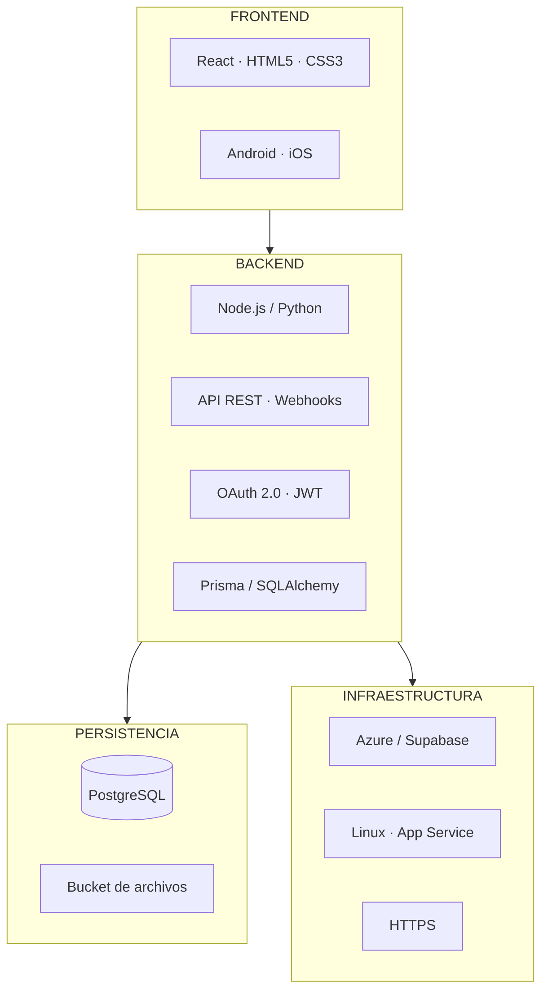

# 09 · Stack tecnológico

> Enumeración de tecnologías exigida por el formato de sustentación, con la justificación de cada elección.

---

## Frontend

| Tecnología | Uso | Por qué |
|---|---|---|
| **React** | Interfaz web | Componentes reutilizables entre los tres módulos. Un mismo componente de tabla sirve para cotizaciones, candidatos y viáticos. |
| **HTML5 / CSS3** | Estructura y estilos | Base estándar, responsive nativo. |
| **Android / iOS** | App móvil | El registro de viáticos ocurre en obra, sin computador. Requiere cámara nativa para los soportes. |

## Backend

| Tecnología | Uso | Por qué |
|---|---|---|
| **Node.js / Python** | Lógica de negocio de los tres microservicios | Ecosistema maduro, buena disponibilidad de talento en Medellín. |
| **API REST** | Comunicación cliente ↔ servidor | Estándar simple, bien documentado, fácil de consumir desde web y móvil. |
| **Webhooks** | Integración con facturación electrónica y nómina | Permite que sistemas externos notifiquen eventos sin polling. |
| **Prisma / SQLAlchemy** | ORM, lógica transaccional | Evita SQL manual, previene inyección, maneja migraciones de esquema. |

## Seguridad

| Tecnología | Uso |
|---|---|
| **OAuth 2.0** | Protocolo de autorización |
| **JWT** | Token de sesión con rol embebido |
| **HTTPS / TLS** | Cifrado en tránsito |
| **Control de roles por módulo** | Comercial, RRHH, contabilidad, aprobador, empleado |

## Persistencia

| Tecnología | Uso | Por qué |
|---|---|---|
| **PostgreSQL** | Base de datos relacional | Los datos son fuertemente relacionales (cotización → cliente → productos → precios). Requiere integridad referencial y transacciones. Open source, sin costo de licencia. |
| **Bucket de archivos** | Hojas de vida en PDF y fotos de soportes | Los archivos binarios no van en la base de datos: encarecen backups y degradan el rendimiento. |

## Infraestructura

| Tecnología | Uso | Por qué |
|---|---|---|
| **Azure o Supabase** | Plataforma cloud | Se alinea con lo que ya se maneja en IDT. Supabase da PostgreSQL, autenticación y storage en un solo servicio, lo que reduce la complejidad de operación. |
| **Instancia Linux o Azure App Service** | Servidores | Servicio administrado para no dedicar tiempo a administración de sistemas. |
| **HTTPS sobre banda ancha corporativa** | Conectividad | Estándar de la red interna de GALCO. |

---

## Diagrama del stack

---

## Decisiones de arquitectura y sus alternativas descartadas

| Decisión | Alternativa descartada | Razón |
|---|---|---|
| PostgreSQL | MongoDB | Los datos son relacionales por naturaleza. Una cotización sin integridad referencial con su catálogo de precios es exactamente el problema que se quiere resolver. |
| Microservicios | Monolito | Los tres módulos pertenecen a áreas distintas y salen en releases distintos. La independencia de despliegue y de falla es más valiosa que la simplicidad inicial. |
| React | Angular / Vue | Mayor disponibilidad de talento local y ecosistema de componentes. |
| App móvil nativa | Solo web responsive | El acceso a cámara para soportes de viáticos y el uso en obra con conectividad intermitente justifican la app. |
| Bucket de archivos | BLOB en base de datos | Costo de backup y rendimiento. |

---

**Anterior:** [[08 Arquitectura]] · **Siguiente:** [[10 Competencia y ventaja competitiva]]
