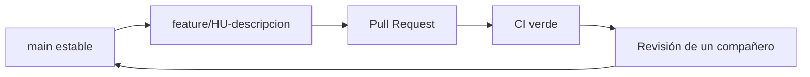

# 18 · Sprint 1 — Calidad del software

## Convención de nombres

| Elemento                 | Regla                                   | Ejemplo                            |
| ------------------------ | --------------------------------------- | ---------------------------------- |
| Componentes y vistas Vue | PascalCase                              | `TravelRequestsView.vue`           |
| Variables y funciones    | camelCase; verbos para acciones         | `calcularTotal`, `solicitudActual` |
| Constantes               | UPPER_SNAKE_CASE                        | `MAX_FILE_SIZE`                    |
| Servicios backend        | sustantivo de dominio + acción clara    | `solicitudesService.create`        |
| Archivos backend         | minúsculas y sufijo por responsabilidad | `solicitudes.controller.js`        |
| Rutas REST               | sustantivos en plural y kebab-case      | `/api/solicitudes-viaticos`        |
| Casos de prueba          | `CP-NN` y descripción observable        | `CP-14 Enviar y aprobar`           |
| Historias/criterios      | `HU-NN` / `CA-NN`                       | `HU-20 / CA-01`                    |

Los nombres usan el lenguaje del negocio en español cuando representan conceptos GALCO. Los nombres propios del framework conservan su convención. Se evitan abreviaturas ambiguas y comentarios que repitan literalmente el código.

## Análisis estático y formato

- ESLint aplica la configuración recomendada de JavaScript y reglas esenciales de Vue.
- `no-undef` y variables no usadas están activas como error.
- Prettier fija el formato de JavaScript, Vue, CSS, Markdown, JSON y YAML.
- `npm run lint` analiza frontend y backend.
- `npm run format:check` comprueba que el formato sea reproducible.
- `npm run format` corrige el formato localmente.

Configuraciones: `eslint.config.mjs`, `.prettierrc.json` y `.prettierignore`.

## Estrategia de ramas

Se usa GitHub Flow:

- `main` debe mantenerse ejecutable.
- Cada rama cubre un cambio coherente y enlaza los issues relacionados.
- No se mezclan refactorizaciones ajenas con una historia.
- El PR explica alcance, trazabilidad HU/CP, evidencia y deuda.
- Se requiere al menos una aprobación de una persona distinta al autor.
- La protección de rama se configura en GitHub para impedir merge con CI fallida.

## Integración continua

`.github/workflows/ci.yml` se ejecuta en pushes y pull requests a `main` con Node 22.13 y realiza:

1. instalación reproducible de dependencias raíz, frontend y backend;
2. verificación de formato;
3. análisis ESLint;
4. pruebas frontend y backend;
5. compilación de producción;
6. auditoría de dependencias con umbral alto.

Una ejecución local equivalente está disponible mediante `npm run verify`.

## Seguridad y vulnerabilidades

| Control                | Implementación                            | Frecuencia                |
| ---------------------- | ----------------------------------------- | ------------------------- |
| SAST                   | CodeQL para JavaScript                    | PR, push a main y semanal |
| Dependencias           | Dependabot                                | Semanal                   |
| Auditoría local/CI     | `npm audit --omit=dev --audit-level=high` | Cada verificación         |
| Validación de entradas | Joi en rutas Hapi                         | Cada solicitud            |
| Autorización           | Roles y propietario en backend            | Cada operación protegida  |
| Secretos               | Variables de entorno, `.env` excluido     | Continua                  |

Las alertas moderadas transitivas se registran como deuda y se actualizan sin romper compatibilidad. Ninguna vulnerabilidad alta conocida puede aceptarse sin análisis, responsable y fecha de corrección.

## Criterios para aprobar un Pull Request

- CI verde.
- Una aprobación de otro integrante.
- Historia y criterios enlazados.
- Casos positivos y negativos relevantes.
- Sin credenciales, datos personales ni archivos innecesarios.
- Cambios visuales revisados en escritorio y móvil.
- Documentación actualizada cuando cambia un contrato o flujo.

## Referencias

- [ESLint — Getting Started](https://eslint.org/docs/latest/use/getting-started)
- [Vue — Style Guide](https://vuejs.org/style-guide/)
- [Prettier — Why Prettier](https://prettier.io/docs/why-prettier)
- [GitHub Flow](https://docs.github.com/en/get-started/using-github/github-flow)
- [GitHub — About protected branches](https://docs.github.com/en/repositories/configuring-branches-and-merges-in-your-repository/managing-protected-branches/about-protected-branches)
- [OWASP Application Security Verification Standard](https://owasp.org/www-project-application-security-verification-standard/)
